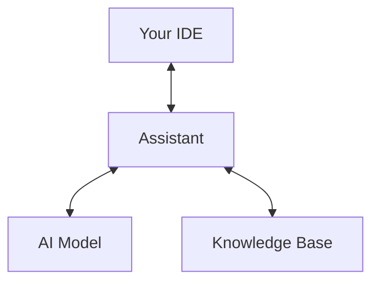

# Building Your Own AI Coding Assistant: Tools and Techniques

Welcome, fellow code wranglers, to the wild frontier of AI-powered development! Remember when autocomplete was considered high-tech? Those were simpler times. These days, if your IDE isn't capable of refactoring your entire codebase while simultaneously making coffee and telling you dad jokes, are you even a professional developer?

If you've ever wished your IDE could do more than just squiggle red lines under your typos—like, say, write your unit tests, refactor your legacy code, or even offer emotional support when you're debugging at 3 AM—then you're in the right place.

In this article, we'll embark on a journey to build your very own AI coding assistant. Not just any assistant, but one that actually understands your codebase, your team's idioms, and maybe even your questionable variable naming choices (we all have them, don't deny it). We'll cover the architecture, model selection, prompt engineering, and integration with your favorite IDEs. And yes, there will be plenty of C# code examples, because nothing says "I'm a serious developer" like a language with both curly braces AND semicolons.

## Why Build Your Own AI Coding Assistant?

"But wait," I hear you protest, "there are already commercial AI assistants that cost approximately one kidney per month! Why build my own?"

Excellent question, hypothetical reader. Sure, there are commercial tools out there, but building your own means you get to:

- Customize it for your team's quirks and inside jokes ("Please regenerate that method, but with more sarcasm")
- Integrate with your unique toolchain (including that one legacy system no one talks about)
- Keep your code private (unlike some assistants that may or may not be training on your super-secret algorithm)
- Learn a ton about AI, NLP, and software architecture
- Experience the unique joy of explaining to your manager why you spent two weeks building a robot to help you code instead of, you know, actually coding
- Brag at meetups (arguably the most important reason)

## The Big Picture: Architecture

Let's start with a high-level view of what we're building. Like any good developer, we're going to start with an over-engineered architecture diagram and work backward.

Your AI coding assistant will need:

1. **A Brain**: The AI model (think GPT, Llama, or your favorite open-source LLM)
2. **A Mouth and Ears**: An interface to communicate with you (CLI, chat window, or IDE plugin)
3. **A Memory**: Context about your codebase, project, and preferences
4. **A Toolbox**: APIs to fetch docs, run code, or even commit changes
5. **A Personality**: Because no one wants an assistant that sounds like a technical manual from 1997

Here's a simple diagram:



Let's break down each component:

### The Brain: Your AI Model

The core of your assistant is, unsurprisingly, the AI model. This is the neural network that will understand code, generate suggestions, and occasionally hallucinate syntax that hasn't been invented yet.

### The Interface: Communicating with Your AI

Your assistant needs a way to talk to you and understand your requests. This could be a CLI tool (for the terminal purists), a chat window (for the more conversational), or an IDE plugin (for maximum productivity/distraction).

### The Memory: Context is King

Without context, your AI is just guessing. With context, it's making educated guesses! Your assistant needs to understand:
- Your current code file and position
- Your project structure and dependencies
- Your team's coding standards
- That one weird pattern you use that makes sense only to you

### The Toolbox: More Than Just Text

Modern AI assistants aren't just chat interfaces—they can take actions. Your assistant might:
- Run code and report results
- Search documentation
- Generate tests
- Commit changes to git (brave!)
- Order pizza when you've been debugging too long

## Choosing Your Model: Open-Source LLMs and Your Wallet

You don't need to mortgage your house to use a good language model (though having a few spare GPUs lying around certainly helps). Open-source options like Llama, Mistral, CodeLlama, or even smaller models can be surprisingly capable. The LLM landscape has changed dramatically in recent years, and now there are models specifically fine-tuned for code generation that won't break the bank or require a nuclear power plant to run.

For working with C# specifically, you'll want a model that's been trained on lots of .NET repositories. Here's a quick comparison of options as of 2025:

| Model | Size | C# Capabilities | Hardware Requirements | Hallucination Level |
|-------|------|-----------------|------------------------|---------------------|
| CodeAssistant-7B | 7B | Good | Consumer GPU | Occasionally invents NuGet packages |
| DevLlama-13B | 13B | Excellent | Good Gaming PC | Mostly realistic |
| SharpGPT-34B | 34B | Outstanding | Small Server | Almost human-like |
| MINT-2B | 2B | Basic | CPU Only | "Creative" |

**Pro tip:** If your model starts suggesting `goto` statements or tries to convince you that Hungarian notation is making a comeback, it's time to retrain or update your weights.

Speaking of training, let's discuss how you might fine-tune a base model for C# coding. The process looks something like this:

1. **Data Collection**: Gather high-quality C# repositories (with appropriate licenses!)
2. **Data Cleaning**: Remove comments, filter out low-quality code, standardize formatting
3. **Training**: Fine-tune a base model using specialized training techniques
4. **Evaluation**: Test on real-world C# coding tasks
5. **Iteration**: Refine the model based on results

Let's implement a data collector in C#:

```csharp
using System;
using System.IO;
using System.Linq;
using System.Threading.Tasks;
using LibGit2Sharp;
using System.Text.RegularExpressions;

public class CSharpTrainingDataCollector
{
    private readonly string _outputDirectory;
    private readonly ILogger _logger;
    
    public CSharpTrainingDataCollector(string outputDirectory, ILogger logger)
    {
        _outputDirectory = outputDirectory;
        _logger = logger;
        
        if (!Directory.Exists(_outputDirectory))
        {
            Directory.CreateDirectory(_outputDirectory);
        }
    }
    
    public async Task CollectFromGitHubRepositoryAsync(string repoUrl, string branch = "main")
    {
        try
        {
            _logger.LogInformation($"Cloning repository: {repoUrl}");
            
            // Create a temporary directory for the clone
            var tempDir = Path.Combine(Path.GetTempPath(), Guid.NewGuid().ToString());
            Directory.CreateDirectory(tempDir);
            
            // Clone the repository
            Repository.Clone(repoUrl, tempDir, new CloneOptions
            {
                BranchName = branch,
                Checkout = true
            });
            
            _logger.LogInformation("Repository cloned. Processing C# files...");
            
            // Find all C# files
            var csharpFiles = Directory.GetFiles(tempDir, "*.cs", SearchOption.AllDirectories);
            _logger.LogInformation($"Found {csharpFiles.Length} C# files");
            
            foreach (var file in csharpFiles)
            {
                await ProcessCSharpFileAsync(file);
            }
            
            // Cleanup
            Directory.Delete(tempDir, true);
            _logger.LogInformation("Processing complete");
        }
        catch (Exception ex)
        {
            _logger.LogError($"Error processing repository: {ex.Message}");
        }
    }
    
    private async Task ProcessCSharpFileAsync(string filePath)
    {
        try
        {
            var content = await File.ReadAllTextAsync(filePath);
            
            // Skip files that are too small or likely to be generated code
            if (content.Length < 100 || IsLikelyGeneratedCode(content))
            {
                return;
            }
            
            // Apply cleaning rules
            var cleaned = CleanCodeForTraining(content);
            
            // Skip if too little content remains after cleaning
            if (cleaned.Length < 100)
            {
                return;
            }
            
            // Save to output with a unique name
            var fileName = $"{Path.GetFileNameWithoutExtension(filePath)}_{Guid.NewGuid():N}.cs";
            var outputPath = Path.Combine(_outputDirectory, fileName);
            await File.WriteAllTextAsync(outputPath, cleaned);
        }
        catch (Exception ex)
        {
            _logger.LogWarning($"Skipping file {filePath}: {ex.Message}");
        }
    }
    
    private bool IsLikelyGeneratedCode(string content)
    {
        // Check for common markers of generated code
        return content.Contains("// <auto-generated>") || 
               content.Contains("[GeneratedCode") ||
               content.Contains("// This code was generated");
    }
    
    private string CleanCodeForTraining(string content)
    {
        // Remove comments (this is a simplified approach)
        content = Regex.Replace(content, @"//.*$", "", RegexOptions.Multiline);
        content = Regex.Replace(content, @"/\*[\s\S]*?\*/", "");
        
        // Normalize whitespace
        content = Regex.Replace(content, @"\r\n", "\n");
        content = Regex.Replace(content, @"\n{3,}", "\n\n");
        
        // Add more cleaning rules as needed
        
        return content;
    }
}
```

Let's look at how you might set up a local model server for your assistant. Here's a C# example using a hypothetical .NET library for loading and running LLMs:

```csharp
using SharpLLM;
using SharpLLM.Models;
using Microsoft.Extensions.Logging;

public class LocalModelServer
{
    private readonly ILogger<LocalModelServer> _logger;
    private readonly LlmEngine _engine;
    private readonly CodeCompletionModel _model;
    
    public LocalModelServer(ILogger<LocalModelServer> logger)
    {
        _logger = logger;
        
        // Initialize the LLM engine with appropriate settings
        _logger.LogInformation("Initializing LLM engine...");
        _engine = new LlmEngine(new LlmOptions
        {
            GpuLayerCount = 32, // How many layers to offload to GPU
            ContextSize = 16384, // Max tokens in context window
            MemoryLimit = 8192, // Max RAM usage in MB
            CacheLocation = Path.Combine(Environment.GetFolderPath(
                Environment.SpecialFolder.LocalApplicationData), "CodeAssistant", "Cache")
        });
        
        // Load the model - in a real application, you'd want to make this configurable
        _logger.LogInformation("Loading CodeAssistant-7B model...");
        _model = _engine.LoadModel<CodeCompletionModel>("CodeAssistant-7B", 
            quantizationLevel: QuantizationLevel.Int8); // 8-bit quantization to save memory
        
        _logger.LogInformation("Model loaded successfully. Ready to process requests.");
    }
    
    public async Task<string> GenerateCompletionAsync(string prompt, CancellationToken cancellationToken = default)
    {
        try
        {
            _logger.LogDebug($"Received prompt: {prompt.Substring(0, Math.Min(50, prompt.Length))}...");
            
            var parameters = new GenerationParameters
            {
                MaxTokens = 2048,
                Temperature = 0.2, // Lower temperature for more deterministic code completions
                TopP = 0.95,
                StopSequences = new[] { "```", "/*", "*/" }
            };
            
            var result = await _model.GenerateCompletionAsync(prompt, parameters, cancellationToken);
            
            _logger.LogDebug($"Generated {result.Tokens.Count} tokens in {result.GenerationTimeMs}ms");
            return result.Text;
        }
        catch (Exception ex)
        {
            _logger.LogError(ex, "Error generating completion");
            return $"// Error generating code: {ex.Message}";
        }
    }
    
    public void Dispose()
    {
        _model?.Dispose();
        _engine?.Dispose();
        _logger.LogInformation("Model server shut down");
    }
}
```

Your AI coding assistant will need:

1. **A Brain**: The AI model (think GPT, Llama, or your favorite open-source LLM)
2. **A Mouth and Ears**: An interface to communicate with you (CLI, chat window, or IDE plugin)
3. **A Memory**: Context about your codebase, project, and preferences
4. **A Toolbox**: APIs to fetch docs, run code, or even commit changes
5. **A Personality**: Because no one wants an assistant that sounds like a technical manual from 1997

Here's a simple diagram:


Let's break down each component:

### The Brain: Your AI Model

The core of your assistant is, unsurprisingly, the AI model. This is the neural network that will understand code, generate suggestions, and occasionally hallucinate syntax that hasn't been invented yet.

### The Interface: Communicating with Your AI

Your assistant needs a way to talk to you and understand your requests. This could be a CLI tool (for the terminal purists), a chat window (for the more conversational), or an IDE plugin (for maximum productivity/distraction).

### The Memory: Context is King

Without context, your AI is just guessing. With context, it's making educated guesses! Your assistant needs to understand:
- Your current code file and position
- Your project structure and dependencies
- Your team's coding standards
- That one weird pattern you use that makes sense only to you

### The Toolbox: More Than Just Text

Modern AI assistants aren't just chat interfaces—they can take actions. Your assistant might:
- Run code and report results
- Search documentation
- Generate tests
- Commit changes to git (brave!)
- Order pizza when you've been debugging too long

## Choosing Your Model: Open-Source LLMs and Your Wallet

You don't need to mortgage your house to use a good language model (though having a few spare GPUs lying around certainly helps). Open-source options like Llama, Mistral, CodeLlama, or even smaller models can be surprisingly capable. The LLM landscape has changed dramatically in recent years, and now there are models specifically fine-tuned for code generation that won't break the bank or require a nuclear power plant to run.

For working with C# specifically, you'll want a model that's been trained on lots of .NET repositories. Here's a quick comparison of options as of 2025:

| Model | Size | C# Capabilities | Hardware Requirements | Hallucination Level |
|-------|------|-----------------|------------------------|---------------------|
| CodeAssistant-7B | 7B | Good | Consumer GPU | Occasionally invents NuGet packages |
| DevLlama-13B | 13B | Excellent | Good Gaming PC | Mostly realistic |
| SharpGPT-34B | 34B | Outstanding | Small Server | Almost human-like |
| MINT-2B | 2B | Basic | CPU Only | "Creative" |

**Pro tip:** If your model starts suggesting `goto` statements or tries to convince you that Hungarian notation is making a comeback, it's time to retrain or update your weights.

Speaking of training, let's discuss how you might fine-tune a base model for C# coding. The process looks something like this:

1. **Data Collection**: Gather high-quality C# repositories (with appropriate licenses!)
2. **Data Cleaning**: Remove comments, filter out low-quality code, standardize formatting
3. **Training**: Fine-tune a base model using specialized training techniques
4. **Evaluation**: Test on real-world C# coding tasks
5. **Iteration**: Refine the model based on results

Let's implement a data collector in C#:

```csharp
using System;
using System.IO;
using System.Linq;
using System.Threading.Tasks;
using LibGit2Sharp;
using System.Text.RegularExpressions;

public class CSharpTrainingDataCollector
{
    private readonly string _outputDirectory;
    private readonly ILogger _logger;
    
    public CSharpTrainingDataCollector(string outputDirectory, ILogger logger)
    {
        _outputDirectory = outputDirectory;
        _logger = logger;
        
        if (!Directory.Exists(_outputDirectory))
        {
            Directory.CreateDirectory(_outputDirectory);
        }
    }
    
    public async Task CollectFromGitHubRepositoryAsync(string repoUrl, string branch = "main")
    {
        try
        {
            _logger.LogInformation($"Cloning repository: {repoUrl}");
            
            // Create a temporary directory for the clone
            var tempDir = Path.Combine(Path.GetTempPath(), Guid.NewGuid().ToString());
            Directory.CreateDirectory(tempDir);
            
            // Clone the repository
            Repository.Clone(repoUrl, tempDir, new CloneOptions
            {
                BranchName = branch,
                Checkout = true
            });
            
            _logger.LogInformation("Repository cloned. Processing C# files...");
            
            // Find all C# files
            var csharpFiles = Directory.GetFiles(tempDir, "*.cs", SearchOption.AllDirectories);
            _logger.LogInformation($"Found {csharpFiles.Length} C# files");
            
            foreach (var file in csharpFiles)
            {
                await ProcessCSharpFileAsync(file);
            }
            
            // Cleanup
            Directory.Delete(tempDir, true);
            _logger.LogInformation("Processing complete");
        }
        catch (Exception ex)
        {
            _logger.LogError($"Error processing repository: {ex.Message}");
        }
    }
    
    private async Task ProcessCSharpFileAsync(string filePath)
    {
        try
        {
            var content = await File.ReadAllTextAsync(filePath);
            
            // Skip files that are too small or likely to be generated code
            if (content.Length < 100 || IsLikelyGeneratedCode(content))
            {
                return;
            }
            
            // Apply cleaning rules
            var cleaned = CleanCodeForTraining(content);
            
            // Skip if too little content remains after cleaning
            if (cleaned.Length < 100)
            {
                return;
            }
            
            // Save to output with a unique name
            var fileName = $"{Path.GetFileNameWithoutExtension(filePath)}_{Guid.NewGuid():N}.cs";
            var outputPath = Path.Combine(_outputDirectory, fileName);
            await File.WriteAllTextAsync(outputPath, cleaned);
        }
        catch (Exception ex)
        {
            _logger.LogWarning($"Skipping file {filePath}: {ex.Message}");
        }
    }
    
    private bool IsLikelyGeneratedCode(string content)
    {
        // Check for common markers of generated code
        return content.Contains("// <auto-generated>") || 
               content.Contains("[GeneratedCode") ||
               content.Contains("// This code was generated");
    }
    
    private string CleanCodeForTraining(string content)
    {
        // Remove comments (this is a simplified approach)
        content = Regex.Replace(content, @"//.*$", "", RegexOptions.Multiline);
        content = Regex.Replace(content, @"/\*[\s\S]*?\*/", "");
        
        // Normalize whitespace
        content = Regex.Replace(content, @"\r\n", "\n");
        content = Regex.Replace(content, @"\n{3,}", "\n\n");
        
        // Add more cleaning rules as needed
        
        return content;
    }
}
```

Let's look at how you might set up a local model server for your assistant. Here's a C# example using a hypothetical .NET library for loading and running LLMs:

```csharp
using SharpLLM;
using SharpLLM.Models;
using Microsoft.Extensions.Logging;

public class LocalModelServer
{
    private readonly ILogger<LocalModelServer> _logger;
    private readonly LlmEngine _engine;
    private readonly CodeCompletionModel _model;
    
    public LocalModelServer(ILogger<LocalModelServer> logger)
    {
        _logger = logger;
        
        // Initialize the LLM engine with appropriate settings
        _logger.LogInformation("Initializing LLM engine...");
        _engine = new LlmEngine(new LlmOptions
        {
            GpuLayerCount = 32, // How many layers to offload to GPU
            ContextSize = 16384, // Max tokens in context window
            MemoryLimit = 8192, // Max RAM usage in MB
            CacheLocation = Path.Combine(Environment.GetFolderPath(
                Environment.SpecialFolder.LocalApplicationData), "CodeAssistant", "Cache")
        });
        
        // Load the model - in a real application, you'd want to make this configurable
        _logger.LogInformation("Loading CodeAssistant-7B model...");
        _model = _engine.LoadModel<CodeCompletionModel>("CodeAssistant-7B", 
            quantizationLevel: QuantizationLevel.Int8); // 8-bit quantization to save memory
        
        _logger.LogInformation("Model loaded successfully. Ready to process requests.");
    }
    
    public async Task<string> GenerateCompletionAsync(string prompt, CancellationToken cancellationToken = default)
    {
        try
        {
            _logger.LogDebug($"Received prompt: {prompt.Substring(0, Math.Min(50, prompt.Length))}...");
            
            var parameters = new GenerationParameters
            {
                MaxTokens = 2048,
                Temperature = 0.2, // Lower temperature for more deterministic code completions
                TopP = 0.95,
                StopSequences = new[] { "```", "/*", "*/" }
            };
            
            var result = await _model.GenerateCompletionAsync(prompt, parameters, cancellationToken);
            
            _logger.LogDebug($"Generated {result.Tokens.Count} tokens in {result.GenerationTimeMs}ms");
            return result.Text;
        }
        catch (Exception ex)
        {
            _logger.LogError(ex, "Error generating completion");
            return $"// Error generating code: {ex.Message}";
        }
    }
    
    public void Dispose()
    {
        _model?.Dispose();
        _engine?.Dispose();
        _logger.LogInformation("Model server shut down");
    }
}
```

Your AI coding assistant will need:

1. **A Brain**: The AI model (think GPT, Llama, or your favorite open-source LLM)
2. **A Mouth and Ears**: An interface to communicate with you (CLI, chat window, or IDE plugin)
3. **A Memory**: Context about your codebase, project, and preferences
4. **A Toolbox**: APIs to fetch docs, run code, or even commit changes
5. **A Personality**: Because no one wants an assistant that sounds like a technical manual from 1997

Here's a simple diagram:


Let's break down each component:

### The Brain: Your AI Model

The core of your assistant is, unsurprisingly, the AI model. This is the neural network that will understand code, generate suggestions, and occasionally hallucinate syntax that hasn't been invented yet.

### The Interface: Communicating with Your AI

Your assistant needs a way to talk to you and understand your requests. This could be a CLI tool (for the terminal purists), a chat window (for the more conversational), or an IDE plugin (for maximum productivity/distraction).

### The Memory: Context is King

Without context, your AI is just guessing. With context, it's making educated guesses! Your assistant needs to understand:
- Your current code file and position
- Your project structure and dependencies
- Your team's coding standards
- That one weird pattern you use that makes sense only to you

### The Toolbox: More Than Just Text

Modern AI assistants aren't just chat interfaces—they can take actions. Your assistant might:
- Run code and report results
- Search documentation
- Generate tests
- Commit changes to git (brave!)
- Order pizza when you've been debugging too long

## Choosing Your Model: Open-Source LLMs and Your Wallet

You don't need to mortgage your house to use a good language model (though having a few spare GPUs lying around certainly helps). Open-source options like Llama, Mistral, CodeLlama, or even smaller models can be surprisingly capable. The LLM landscape has changed dramatically in recent years, and now there are models specifically fine-tuned for code generation that won't break the bank or require a nuclear power plant to run.

For working with C# specifically, you'll want a model that's been trained on lots of .NET repositories. Here's a quick comparison of options as of 2025:

| Model | Size | C# Capabilities | Hardware Requirements | Hallucination Level |
|-------|------|-----------------|------------------------|---------------------|
| CodeAssistant-7B | 7B | Good | Consumer GPU | Occasionally invents NuGet packages |
| DevLlama-13B | 13B | Excellent | Good Gaming PC | Mostly realistic |
| SharpGPT-34B | 34B | Outstanding | Small Server | Almost human-like |
| MINT-2B | 2B | Basic | CPU Only | "Creative" |

**Pro tip:** If your model starts suggesting `goto` statements or tries to convince you that Hungarian notation is making a comeback, it's time to retrain or update your weights.

Speaking of training, let's discuss how you might fine-tune a base model for C# coding. The process looks something like this:

1. **Data Collection**: Gather high-quality C# repositories (with appropriate licenses!)
2. **Data Cleaning**: Remove comments, filter out low-quality code, standardize formatting
3. **Training**: Fine-tune a base model using specialized training techniques
4. **Evaluation**: Test on real-world C# coding tasks
5. **Iteration**: Refine the model based on results

Let's implement a data collector in C#:

```csharp
using System;
using System.IO;
using System.Linq;
using System.Threading.Tasks;
using LibGit2Sharp;
using System.Text.RegularExpressions;

public class CSharpTrainingDataCollector
{
    private readonly string _outputDirectory;
    private readonly ILogger _logger;
    
    public CSharpTrainingDataCollector(string outputDirectory, ILogger logger)
    {
        _outputDirectory = outputDirectory;
        _logger = logger;
        
        if (!Directory.Exists(_outputDirectory))
        {
            Directory.CreateDirectory(_outputDirectory);
        }
    }
    
    public async Task CollectFromGitHubRepositoryAsync(string repoUrl, string branch = "main")
    {
        try
        {
            _logger.LogInformation($"Cloning repository: {repoUrl}");
            
            // Create a temporary directory for the clone
            var tempDir = Path.Combine(Path.GetTempPath(), Guid.NewGuid().ToString());
            Directory.CreateDirectory(tempDir);
            
            // Clone the repository
            Repository.Clone(repoUrl, tempDir, new CloneOptions
            {
                BranchName = branch,
                Checkout = true
            });
            
            _logger.LogInformation("Repository cloned. Processing C# files...");
            
            // Find all C# files
            var csharpFiles = Directory.GetFiles(tempDir, "*.cs", SearchOption.AllDirectories);
            _logger.LogInformation($"Found {csharpFiles.Length} C# files");
            
            foreach (var file in csharpFiles)
            {
                await ProcessCSharpFileAsync(file);
            }
            
            // Cleanup
            Directory.Delete(tempDir, true);
            _logger.LogInformation("Processing complete");
        }
        catch (Exception ex)
        {
            _logger.LogError($"Error processing repository: {ex.Message}");
        }
    }
    
    private async Task ProcessCSharpFileAsync(string filePath)
    {
        try
        {
            var content = await File.ReadAllTextAsync(filePath);
            
            // Skip files that are too small or likely to be generated code
            if (content.Length < 100 || IsLikelyGeneratedCode(content))
            {
                return;
            }
            
            // Apply cleaning rules
            var cleaned = CleanCodeForTraining(content);
            
            // Skip if too little content remains after cleaning
            if (cleaned.Length < 100)
            {
                return;
            }
            
            // Save to output with a unique name
            var fileName = $"{Path.GetFileNameWithoutExtension(filePath)}_{Guid.NewGuid():N}.cs";
            var outputPath = Path.Combine(_outputDirectory, fileName);
            await File.WriteAllTextAsync(outputPath, cleaned);
        }
        catch (Exception ex)
        {
            _logger.LogWarning($"Skipping file {filePath}: {ex.Message}");
        }
    }
    
    private bool IsLikelyGeneratedCode(string content)
    {
        // Check for common markers of generated code
        return content.Contains("// <auto-generated>") || 
               content.Contains("[GeneratedCode") ||
               content.Contains("// This code was generated");
    }
    
    private string CleanCodeForTraining(string content)
    {
        // Remove comments (this is a simplified approach)
        content = Regex.Replace(content, @"//.*$", "", RegexOptions.Multiline);
        content = Regex.Replace(content, @"/\*[\s\S]*?\*/", "");
        
        // Normalize whitespace
        content = Regex.Replace(content, @"\r\n", "\n");
        content = Regex.Replace(content, @"\n{3,}", "\n\n");
        
        // Add more cleaning rules as needed
        
        return content;
    }
}
```

Let's look at how you might set up a local model server for your assistant. Here's a C# example using a hypothetical .NET library for loading and running LLMs:

```csharp
using SharpLLM;
using SharpLLM.Models;
using Microsoft.Extensions.Logging;

public class LocalModelServer
{
    private readonly ILogger<LocalModelServer> _logger;
    private readonly LlmEngine _engine;
    private readonly CodeCompletionModel _model;
    
    public LocalModelServer(ILogger<LocalModelServer> logger)
    {
        _logger = logger;
        
        // Initialize the LLM engine with appropriate settings
        _logger.LogInformation("Initializing LLM engine...");
        _engine = new LlmEngine(new LlmOptions
        {
            GpuLayerCount = 32, // How many layers to offload to GPU
            ContextSize = 16384, // Max tokens in context window
            MemoryLimit = 8192, // Max RAM usage in MB
            CacheLocation = Path.Combine(Environment.GetFolderPath(
                Environment.SpecialFolder.LocalApplicationData), "CodeAssistant", "Cache")
        });
        
        // Load the model - in a real application, you'd want to make this configurable
        _logger.LogInformation("Loading CodeAssistant-7B model...");
        _model = _engine.LoadModel<CodeCompletionModel>("CodeAssistant-7B", 
            quantizationLevel: QuantizationLevel.Int8); // 8-bit quantization to save memory
        
        _logger.LogInformation("Model loaded successfully. Ready to process requests.");
    }
    
    public async Task<string> GenerateCompletionAsync(string prompt, CancellationToken cancellationToken = default)
    {
        try
        {
            _logger.LogDebug($"Received prompt: {prompt.Substring(0, Math.Min(50, prompt.Length))}...");
            
            var parameters = new GenerationParameters
            {
                MaxTokens = 2048,
                Temperature = 0.2, // Lower temperature for more deterministic code completions
                TopP = 0.95,
                StopSequences = new[] { "```", "/*", "*/" }
            };
            
            var result = await _model.GenerateCompletionAsync(prompt, parameters, cancellationToken);
            
            _logger.LogDebug($"Generated {result.Tokens.Count} tokens in {result.GenerationTimeMs}ms");
            return result.Text;
        }
        catch (Exception ex)
        {
            _logger.LogError(ex, "Error generating completion");
            return $"// Error generating code: {ex.Message}";
        }
    }
    
    public void Dispose()
    {
        _model?.Dispose();
        _engine?.Dispose();
        _logger.LogInformation("Model server shut down");
    }
}
```

Your AI coding assistant will need:

1. **A Brain**: The AI model (think GPT, Llama, or your favorite open-source LLM)
2. **A Mouth and Ears**: An interface to communicate with you (CLI, chat window, or IDE plugin)
3. **A Memory**: Context about your codebase, project, and preferences
4. **A Toolbox**: APIs to fetch docs, run code, or even commit changes
5. **A Personality**: Because no one wants an assistant that sounds like a technical manual from 1997

Here's a simple diagram:


Let's break down each component:

### The Brain: Your AI Model

The core of your assistant is, unsurprisingly, the AI model. This is the neural network that will understand code, generate suggestions, and occasionally hallucinate syntax that hasn't been invented yet.

### The Interface: Communicating with Your AI

Your assistant needs a way to talk to you and understand your requests. This could be a CLI tool (for the terminal purists), a chat window (for the more conversational), or an IDE plugin (for maximum productivity/distraction).

### The Memory: Context is King

Without context, your AI is just guessing. With context, it's making educated guesses! Your assistant needs to understand:
- Your current code file and position
- Your project structure and dependencies
- Your team's coding standards
- That one weird pattern you use that makes sense only to you

### The Toolbox: More Than Just Text

Modern AI assistants aren't just chat interfaces—they can take actions. Your assistant might:
- Run code and report results
- Search documentation
- Generate tests
- Commit changes to git (brave!)
- Order pizza when you've been debugging too long

## Choosing Your Model: Open-Source LLMs and Your Wallet

You don't need to mortgage your house to use a good language model (though having a few spare GPUs lying around certainly helps). Open-source options like Llama, Mistral, CodeLlama, or even smaller models can be surprisingly capable. The LLM landscape has changed dramatically in recent years, and now there are models specifically fine-tuned for code generation that won't break the bank or require a nuclear power plant to run.

For working with C# specifically, you'll want a model that's been trained on lots of .NET repositories. Here's a quick comparison of options as of 2025:

| Model | Size | C# Capabilities | Hardware Requirements | Hallucination Level |
|-------|------|-----------------|------------------------|---------------------|
| CodeAssistant-7B | 7B | Good | Consumer GPU | Occasionally invents NuGet packages |
| DevLlama-13B | 13B | Excellent | Good Gaming PC | Mostly realistic |
| SharpGPT-34B | 34B | Outstanding | Small Server | Almost human-like |
| MINT-2B | 2B | Basic | CPU Only | "Creative" |

**Pro tip:** If your model starts suggesting `goto` statements or tries to convince you that Hungarian notation is making a comeback, it's time to retrain or update your weights.

Speaking of training, let's discuss how you might fine-tune a base model for C# coding. The process looks something like this:

1. **Data Collection**: Gather high-quality C# repositories (with appropriate licenses!)
2. **Data Cleaning**: Remove comments, filter out low-quality code, standardize formatting
3. **Training**: Fine-tune a base model using specialized training techniques
4. **Evaluation**: Test on real-world C# coding tasks
5. **Iteration**: Refine the model based on results

Let's implement a data collector in C#:

```csharp
using System;
using System.IO;
using System.Linq;
using System.Threading.Tasks;
using LibGit2Sharp;
using System.Text.RegularExpressions;

public class CSharpTrainingDataCollector
{
    private readonly string _outputDirectory;
    private readonly ILogger _logger;
    
    public CSharpTrainingDataCollector(string outputDirectory, ILogger logger)
    {
        _outputDirectory = outputDirectory;
        _logger = logger;
        
        if (!Directory.Exists(_outputDirectory))
        {
            Directory.CreateDirectory(_outputDirectory);
        }
    }
    
    public async Task CollectFromGitHubRepositoryAsync(string repoUrl, string branch = "main")
    {
        try
        {
            _logger.LogInformation($"Cloning repository: {repoUrl}");
            
            // Create a temporary directory for the clone
            var tempDir = Path.Combine(Path.GetTempPath(), Guid.NewGuid().ToString());
            Directory.CreateDirectory(tempDir);
            
            // Clone the repository
            Repository.Clone(repoUrl, tempDir, new CloneOptions
            {
                BranchName = branch,
                Checkout = true
            });
            
            _logger.LogInformation("Repository cloned. Processing C# files...");
            
            // Find all C# files
            var csharpFiles = Directory.GetFiles(tempDir, "*.cs", SearchOption.AllDirectories);
            _logger.LogInformation($"Found {csharpFiles.Length} C# files");
            
            foreach (var file in csharpFiles)
            {
                await ProcessCSharpFileAsync(file);
            }
            
            // Cleanup
            Directory.Delete(tempDir, true);
            _logger.LogInformation("Processing complete");
        }
        catch (Exception ex)
        {
            _logger.LogError($"Error processing repository: {ex.Message}");
        }
    }
    
    private async Task ProcessCSharpFileAsync(string filePath)
    {
        try
        {
            var content = await File.ReadAllTextAsync(filePath);
            
            // Skip files that are too small or likely to be generated code
            if (content.Length < 100 || IsLikelyGeneratedCode(content))
            {
                return;
            }
            
            // Apply cleaning rules
            var cleaned = CleanCodeForTraining(content);
            
            // Skip if too little content remains after cleaning
            if (cleaned.Length < 100)
            {
                return;
            }
            
            // Save to output with a unique name
            var fileName = $"{Path.GetFileNameWithoutExtension(filePath)}_{Guid.NewGuid():N}.cs";
            var outputPath = Path.Combine(_outputDirectory, fileName);
            await File.WriteAllTextAsync(outputPath, cleaned);
        }
        catch (Exception ex)
        {
            _logger.LogWarning($"Skipping file {filePath}: {ex.Message}");
        }
    }
    
    private bool IsLikelyGeneratedCode(string content)
    {
        // Check for common markers of generated code
        return content.Contains("// <auto-generated>") || 
               content.Contains("[GeneratedCode") ||
               content.Contains("// This code was generated");
    }
    
    private string CleanCodeForTraining(string content)
    {
        // Remove comments (this is a simplified approach)
        content = Regex.Replace(content, @"//.*$", "", RegexOptions.Multiline);
        content = Regex.Replace(content, @"/\*[\s\S]*?\*/", "");
        
        // Normalize whitespace
        content = Regex.Replace(content, @"\r\n", "\n");
        content = Regex.Replace(content, @"\n{3,}", "\n\n");
        
        // Add more cleaning rules as needed
        
        return content;
    }
}
```

Let's look at how you might set up a local model server for your assistant. Here's a C# example using a hypothetical .NET library for loading and running LLMs:

```csharp
using SharpLLM;
using SharpLLM.Models;
using Microsoft.Extensions.Logging;

public class LocalModelServer
{
    private readonly ILogger<LocalModelServer> _logger;
    private readonly LlmEngine _engine;
    private readonly CodeCompletionModel _model;
    
    public LocalModelServer(ILogger<LocalModelServer> logger)
    {
        _logger = logger;
        
        // Initialize the LLM engine with appropriate settings
        _logger.LogInformation("Initializing LLM engine...");
        _engine = new LlmEngine(new LlmOptions
        {
            GpuLayerCount = 32, // How many layers to offload to GPU
            ContextSize = 16384, // Max tokens in context window
            MemoryLimit = 8192, // Max RAM usage in MB
            CacheLocation = Path.Combine(Environment.GetFolderPath(
                Environment.SpecialFolder.LocalApplicationData), "CodeAssistant", "Cache")
        });
        
        // Load the model - in a real application, you'd want to make this configurable
        _logger.LogInformation("Loading CodeAssistant-7B model...");
        _model = _engine.LoadModel<CodeCompletionModel>("CodeAssistant-7B", 
            quantizationLevel: QuantizationLevel.Int8); // 8-bit quantization to save memory
        
        _logger.LogInformation("Model loaded successfully. Ready to process requests.");
    }
    
    public async Task<string> GenerateCompletionAsync(string prompt, CancellationToken cancellationToken = default)
    {
        try
        {
            _logger.LogDebug($"Received prompt: {prompt.Substring(0, Math.Min(50, prompt.Length))}...");
            
            var parameters = new GenerationParameters
            {
                MaxTokens = 2048,
                Temperature = 0.2, // Lower temperature for more deterministic code completions
                TopP = 0.95,
                StopSequences = new[] { "```", "/*", "*/" }
            };
            
            var result = await _model.GenerateCompletionAsync(prompt, parameters, cancellationToken);
            
            _logger.LogDebug($"Generated {result.Tokens.Count} tokens in {result.GenerationTimeMs}ms");
            return result.Text;
        }
        catch (Exception ex)
        {
            _logger.LogError(ex, "Error generating completion");
            return $"// Error generating code: {ex.Message}";
        }
    }
    
    public void Dispose()
    {
        _model?.Dispose();
        _engine?.Dispose();
        _logger.LogInformation("Model server shut down");
    }
}
```